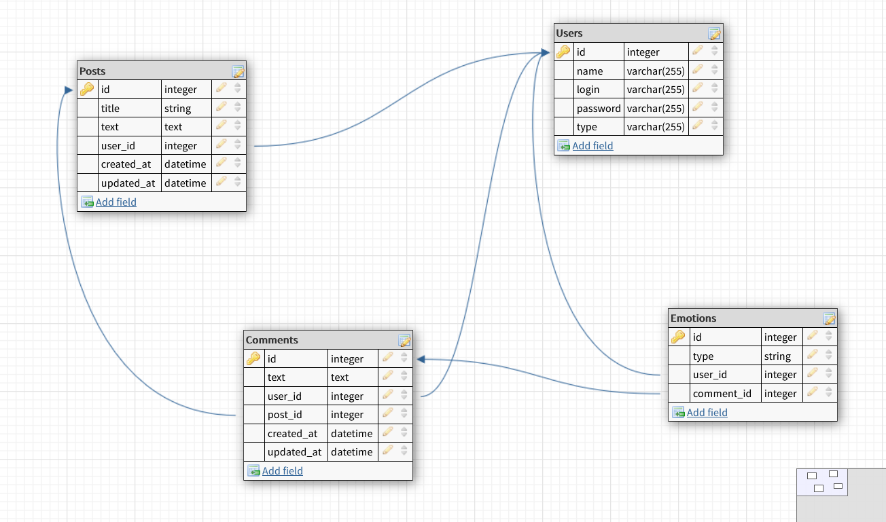

# README

## Technical task

Blog for students to publish their research results.
Students should be able to register/authorize, to write and edit
publications and to comment and "vote" on other posts.

Teachers should be able to comment and "vote" on posts.

"Vote" is an emotion for example, "like" or "rocket" or "confused".



# To Be Fixed
```erbruby
      <%= form_for post, method: :delete do |f|  %>
        <%= f.button('Remove') %>
      <% end %>
```